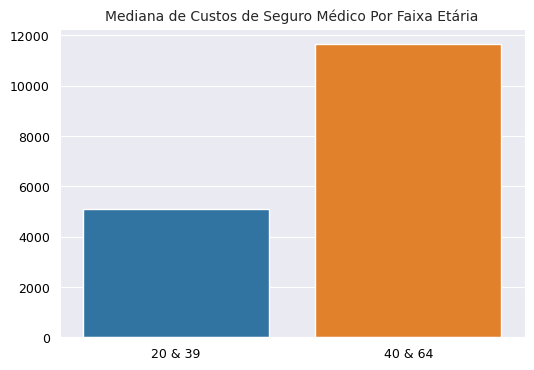
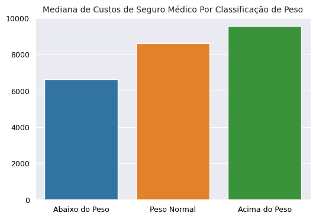

# Previsão de Custo de Seguro Médico (Projeto de Regressão)
### Projeto de Machine Learning

 Neste projeto, utilizo de um conjunto de dados relativo ao custo de seguro médico de vários clientes de uma empresa de seguro, com o objetivo analítico de construir um modelo preditivo de regressão que seja útil e acurado o suficiente para prever o custo de seguro médico de um segurado, com base no perfil e nas características que forem fornecidas sobre tal segurado.
 
Abaixo uma visualização das primeiros cinco linhas do conjunto de dados:

|     | age |   sex  |    bmi   |children| smoker |  region   |   charges   |
|-----|-----|--------|----------|--------|--------|-----------|-------------|
| 0   | 19  | female | 27.900   | 0      | yes    | southwest | 16884.92400 |
| 1   | 18  | male   | 33.770   | 1      | no     | southeast | 1725.55230  |
| 2   | 28  | male   | 33.000   | 3      | no     | southeast | 4449.46200  |
| 3   | 33  | male   | 22.705   | 0      | no     | northwest | 21984.47061 |
| 4   | 32  | male   | 28.880   | 0      | no     | northwest | 3866.85520  |

As variáveis do conjunto de dados acima são:

* **age**: Idade do segurado
* **sex**: Gênero do segurado
* **bmi**: Índice de Massa Corporal ou IMC do segurado
* **children**: Quantidade de filhos do segurado
* **smoker**: Se o segurado é fumante ou não
* **region**: Região em que o segurado mora
* **charges**: O custo de seguro médico do segurado

Em tal conjunto de dados há 1338 linhas e 7 colunas, com três variáveis do tipo texto (sex, smoker, region), uma do tipo inteiro (age) e duas do tipo numericamente flutuante (bmi, charges).

## Tratamento de dados:

Na fase de tratamento de dados, não havia **(1)** dados nulos em nenhuma coluna do dataset, e também **(2)** não havia nenhuma coluna com um tipo de dado que fosse incoerente com os dados da coluna.

Logo, como não havia 'sujeira' nos dados para limpar, então fui diretamente para a fase de análise exploratória de dados (EDA).

## Análise Exploratória de Dados (EDA):

Na fase de análise exploratória, decidi analisar às variáveis preditoras, para poder saber com mais precisão, quais são às variáveis que mais impactam e influenciam nos resultados da variável-alvo (charges).

Abaixo, haverá somente questões e exposições analíticas relativas às variáveis independentes que mais influenciam na variável-alvo:

**(1)** **Qual é a média de idade dos segurados?**

Basicamente, em média os segurados de tal empresa de seguro têm 39 anos, ou seja, majoritariamente os segurados têm uma idade próxima aos 40 anos.

Pelos percentis, 25 % dos segurados têm menos do que 27 anos, o quê significa que 75 % dos clientes têm mais que 27 anos.

50 % dos segurados têm menos do que 39 anos, o quê significa que à outra metade de 50 % têm mais que 39 anos.

E por fim, 75 % têm menos que 51 anos, o quê significa que 25 % dos segurados são mais velhos do que 51 anos.

**(2)** **Qual é a mediana de custos de seguro médico para jovens adultos (20 e 39 anos) e adultos maduros (40 e 69 anos)?**

A mediana de custo de seguro médico para jovens adultos que estão entre 20 e 39 anos é de $ 5.080, isto é, 50 % dos jovens adultos têm um custo de seguro médico abaixo ou acima de $ 5 mil dólares.

Já adultos maduros com uma idade entre 40 e 69 anos, têm uma mediana de custos de seguro médico em torno de $ 11.657, ou seja, 50 % de adultos maduros têm aproximadamente um custo acima ou abaixo de $ 11 mil dólares.

Graficamente, há como expor a diferença de custo de seguro médico em média por faixa etária, entre jovens adultos e adultos maduros:

Este gráfico fornece o possível insight de que segurados mais velhos tendem à ter um custo de seguro médico mais alto do que segurados mais jovens, e tal insight é intuitivamente justificado por ser observado que quão mais velho o ser humano fica, mais demandado se torna os cuidados com a saúde, principalmente pela velhice ser um dos principais fatores que trazem mais complicações na saúde humana.

**(3)** **Qual é a distribuição estatística da idade dos segurados?**

Graficamente, um histograma responde tal questão:

Como observado, na empresa de seguro há mais segurados com 20 anos, isto indica uma distribuição assimétrica em que a maioria dos dados estão abaixo da média de idade, ou seja, a maioria dos segurados têm menos que a média de idade que é 39 anos.

**(4)** **Qual é a mediana de custo de seguro médico por segurados abaixo do peso, acima do peso ou com o peso normal (com base no IMC)?**

Exibi um gráfico de coluna para responder tal questão:

