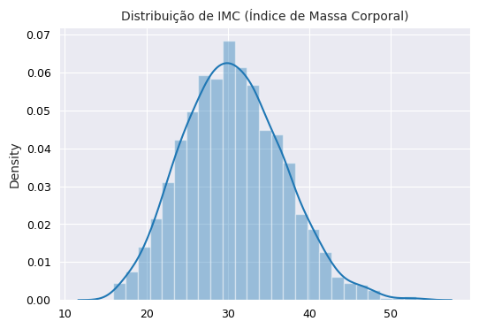
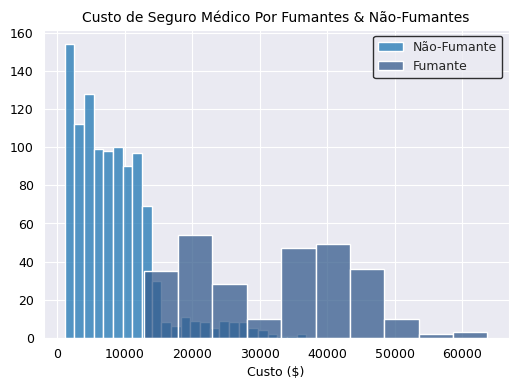
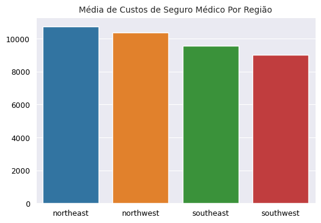
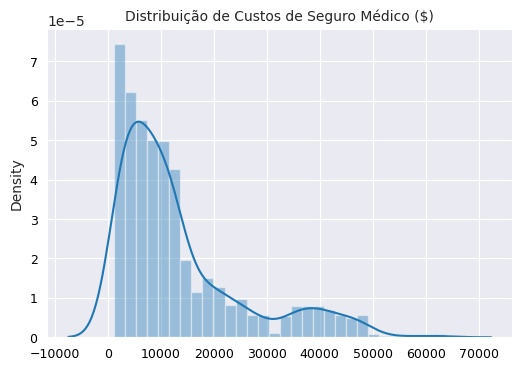
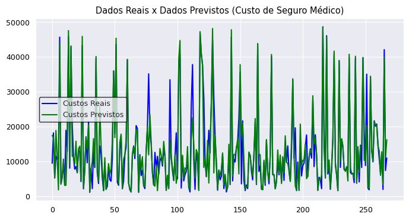

# Previsão de Custo de Seguro Médico (Projeto de Regressão)
### Projeto de Machine Learning

 Neste projeto, utilizo de um conjunto de dados relativo ao custo de seguro médico de vários clientes de uma empresa de seguro, com o objetivo analítico de construir um modelo preditivo de regressão que seja útil e acurado o suficiente para prever o custo de seguro médico de um segurado, com base no perfil e nas características que forem fornecidas sobre tal segurado.
 
Abaixo uma visualização das primeiros cinco linhas do conjunto de dados:

|     | age |   sex  |    bmi   |children| smoker |  region   |   charges   |
|-----|-----|--------|----------|--------|--------|-----------|-------------|
| 0   | 19  | female | 27.900   | 0      | yes    | southwest | 16884.92400 |
| 1   | 18  | male   | 33.770   | 1      | no     | southeast | 1725.55230  |
| 2   | 28  | male   | 33.000   | 3      | no     | southeast | 4449.46200  |
| 3   | 33  | male   | 22.705   | 0      | no     | northwest | 21984.47061 |
| 4   | 32  | male   | 28.880   | 0      | no     | northwest | 3866.85520  |

As variáveis do conjunto de dados acima são:

* **age**: Idade do segurado
* **sex**: Gênero do segurado
* **bmi**: Índice de Massa Corporal ou IMC do segurado
* **children**: Quantidade de filhos do segurado
* **smoker**: Se o segurado é fumante ou não
* **region**: Região em que o segurado mora
* **charges**: O custo de seguro médico do segurado

Em tal conjunto de dados há 1338 linhas e 7 colunas, com três variáveis do tipo texto (sex, smoker, region), uma do tipo inteiro (age) e duas do tipo numericamente flutuante (bmi, charges).

## Tratamento de dados:

Na fase de tratamento de dados, não havia **(1)** dados nulos em nenhuma coluna do dataset, e também **(2)** não havia nenhuma coluna com um tipo de dado que fosse incoerente com os dados da coluna.

Logo, como não havia 'sujeira' nos dados para limpar, então fui diretamente para a fase de análise exploratória de dados (EDA).

## Análise Exploratória de Dados (EDA):

Na fase de análise exploratória, decidi analisar às variáveis preditoras, para poder saber com mais precisão, quais são às variáveis que mais impactam e influenciam nos resultados da variável-alvo (charges).

Abaixo, haverá somente questões e exposições analíticas relativas às variáveis independentes que mais influenciam na variável-alvo:

**(1)** **Qual é a média de idade dos segurados?**

Basicamente, em média os segurados de tal empresa de seguro têm 39 anos, ou seja, majoritariamente os segurados têm uma idade próxima aos 40 anos.

Pelos percentis, 25 % dos segurados têm menos do que 27 anos, o quê significa que 75 % dos clientes têm mais que 27 anos.

50 % dos segurados têm menos do que 39 anos, o quê significa que à outra metade de 50 % têm mais que 39 anos.

E por fim, 75 % têm menos que 51 anos, o quê significa que 25 % dos segurados são mais velhos do que 51 anos.

**(2)** **Qual é a mediana de custos de seguro médico para jovens adultos (20 e 39 anos) e adultos maduros (40 e 69 anos)?**

A mediana de custo de seguro médico para jovens adultos que estão entre 20 e 39 anos é de $ 5.080, isto é, 50 % dos jovens adultos têm um custo de seguro médico abaixo ou acima de $ 5 mil dólares.

Já adultos maduros com uma idade entre 40 e 69 anos, têm uma mediana de custos de seguro médico em torno de $ 11.657, ou seja, 50 % de adultos maduros têm aproximadamente um custo acima ou abaixo de $ 11 mil dólares.

Graficamente, há como expor a diferença de custo de seguro médico em média por faixa etária, entre jovens adultos e adultos maduros:


Este gráfico fornece o possível insight de que segurados mais velhos tendem à ter um custo de seguro médico mais alto do que segurados mais jovens, e tal insight é intuitivamente justificado por ser observado que quão mais velho o ser humano fica, mais demandado se torna os cuidados com a saúde, principalmente pela velhice ser um dos principais fatores que trazem mais complicações na saúde humana.

**(3)** **Qual é a distribuição estatística da idade dos segurados?**

Graficamente, um histograma responde tal questão:


Como observado, na empresa de seguro há mais segurados com 20 anos, isto indica uma distribuição assimétrica em que a maioria dos dados estão abaixo da média de idade, ou seja, a maioria dos segurados têm menos que a média de idade que é 39 anos.

**(4)** **Qual é a mediana de custo de seguro médico por segurados abaixo do peso, acima do peso ou com o peso normal (com base no IMC)?**

Exibi um gráfico de coluna para responder tal questão:


Como é observável acima, metade dos segurados que estão acima do peso apresentam tem um custo de seguro médico acima de $ 9 mil dólares, já os segurados com peso normal têm um custo de seguro médico acima ou abaixo de $ 8 mil dólares (com base na mediana).

**(4)** **Qual é a distribuição estatística do IMC dos segurados?**

Basicamente, com base em informações estatisticamente gerais:

* Os segurados em média tem um IMC de 30, isto significa que os segurados aproximadamente tendem à ter um IMC que os classifica como obesos
* O percentil de 25 % é 26, ou seja, isto significa que 25 % dos segurados têm um IMC saudável abaixo de 26, e ao mesmo tempo 75 % dos segurados estão com IMC acima de 25, o quê significa que 75 % dos segurados estão acima do peso
* O percentil de 75 % é 34, o que sinaliza que 75 % dos segurados tem um IMC abaixo da obesidade severa, enquanto que 25 % dos segurados estão dentro do grupo de obesidade severa (**pela classificação do IMC**)

Um gráfico de histograma com uma curva de densidade expressa a distribuição de IMC dos segurados:



Pelo gráfico acima, é visível uma distribuição simétrica em que a maioria dos dados estão em torno da média, o quê significa que a maioria dos segurados tem um IMC em torno de 30, ou em outras palavras, tal dado sinaliza que a maioria dos segurados estão na faixa de obesidade.

**(5)** **Qual é a mediana de custos de seguro médico por fumantes e não-fumantes?**

No conjunto de dados, quase 80 % dos segurados são não-fumantes, enquanto 20 % são fumantes.

Já na tabela abaixo, é exposto a mediana de custos de seguro médico de fumantes e não-fumantes:

|       smoker   |    median_charges  |
|----------------|--------------------|
|       yes      |      34456.35      |
|       no       |      7345.41       |

O principal insight extraído da tabela acima é:

* 50 % dos segurados fumantes tem um custo de seguro médico acima de $ 34 mil dólares, enquanto 50 % dos não-fumantes tem um custo de seguro superior ou inferior somente à $ 7 mil dólares.

Em gráfico, com um histograma é possível ver essa disparidade ou diferença de custos de seguro médico entre os grupos de segurados fumantes e não-fumantes:



Como é observado acima, o custo de seguro médico de não-fumantes frequentemente é abaixo de $ 10 mil dólares, enquanto o custo de seguro médico de fumantes pela frequência está concentrado na faixa de $ 20 mil dólares.

**(6)** **Qual é a média de custos de seguro médico por região?**

Basicamente, às regiões de segurados presentes nessa empresa de seguro são **(1)** sudeste (com 27 % de segurados), **(2)** sudoeste (com 24 %), **(3)** noroeste (com 24 %), e **(4)** nordeste (com 24 %).

Com um gráfico de coluna, tal pergunta é facilmente respondida:



O nordeste e o noroeste são às duas regiões de segurados com um custo de seguro médico em média mais alto do que em outras regiões

Tais regiões tem segurados com um custo em média de $ 10 mil dólares, enquanto em regiões do sudoeste e sudeste o custo é em torno de $ 9 mil dólares

**(7)** **Qual é a distribuição estatística do custos de seguro médico?**

Com base nas informações estatísticas do custos de seguro médico é possível extrair os seguintes insights:

* Em média, o custo de seguro médico dos segurados é de $ 9 mil dólares
* 75 % dos segurados tem um custo de seguro médico acima de $ 4 mil dólares
* 50 % têm um custo de seguro médico acima ou abaixo de $ 8 mil dólares
* Somente 25 % dos segurados tem um custo de seguro médico acima de $ 12 mil dólares

Estatisticamente, há como analisar a distribuição dos custos de seguro médico em um gráfico:



Pelo gráfico acima, é visível que há uma distribuição assimétrica para à direita, isto é, há dados atípicos (outliers) em tal variável que representam segurados com custos de seguro médico altíssimos em comparação ao restante de segurados.

Com uma distribuição assimétrica à direita, isto significa que a maioria dos segurados têm um custo abaixo da média aparada ($ 9 mil dólares).

Tal assimetria na variável de custos de seguro médico terá que ser tratada na fase de pré-processamento para que o modelo preditivo seja treinado acuradamente para prever o custo de seguro médico dos clientes.

## Pré-processamento de dados:

Nesta fase, o propósito é transformar e preparar o conjunto de dados, para que todos os dados de todas variáveis estejam adequadas para entrar no modelo de aprendizagem de máquina.

### Label Encoding:

Nesta fase, converti às variáveis categóricas do tipo texto (sex, smoker) em variáveis categóricas do tipo inteiro. Como a variável 'sex' representa o gênero dos segurados, então converti 'feminino' para 0 e 'masculino' para 1.

Semelhante, como smoker representa se o segurado fuma ou não, então converti 'no' para 0 e 'yes' para 1.

Abaixo, há o resultado das duas transformações:

|     |   sex  | smoker |
|-----|--------|--------|
| 0   | 0      | 1      |
| 1   | 1      | 0      |
| 2   | 1      | 0      |
| 3   | 1      | 0      |
| 4   | 1      | 0      |

### One-Hot Encoding:

Já nesta fase, realizei o mesmo processo de converter uma variável categórica do tipo texto (region) em variáveis numéricas de 0's e 1's, isto é, criei três colunas adicionais em que cada coluna representa uma região, se o segurado de uma linha for de uma região X, então a coluna X terá 1 e às demais regiões (Y, Z) receberão 0 (e vice-versa).

Abaixo, o resultado de tal transformação:

|           | northwest | southeast | southwest |
|-----------|-----------|-----------|-----------|
| 0         | 0         | 0         | 1         |
| 1         | 0         | 1         | 0         |
| 2         | 0         | 1         | 0         |
| 3         | 1         | 0         | 0         |
| 4         | 1         | 0         | 0         |

## Dados de Treino & Dados de Teste:

Após concluir uma parte da fase de pré-processamento de dados, dividi o conjunto de dados original em dois conjuntos de dados, um conjunto de dados com às **variáveis preditoras (ou independentes)** e outro com a **variável-alvo (ou target)**.

Abaixo, a tabela com às variáveis preditoras que irão alimentar o modelo com dados, para que o modelo obtenha acurácia e precisão o suficiente para prever o custo de seguro médico dos segurados:

|     | age | sex | bmi     |children| smoker    | northwest | southeast | southwest|
|-----|-----|-----|---------|--------|-----------|-----------|-----------|----------|
| 0   | 19  | 0   | 27.900  | 0      | 1         | 0         | 0         | 1        |
| 1   | 18  | 1   | 33.770  | 1      | 0         | 0         | 1         | 0        |
| 2   | 28  | 1   | 33.000  | 3      | 0         | 0         | 1         | 0        |
| 3   | 33  | 1   | 22.705  | 0      | 0         | 1         | 0         | 0        |
| 4   | 32  | 1   | 28.880  | 0      | 0         | 1         | 0         | 0        |

Abaixo, um array com alguns dados da variável-target que será a variável em que o modelo focará em prever:

```
array([16884.924  ,  1725.5523 ,  4449.462  , 21984.47061,  3866.8552 ])
```

Depois dessa separação entre variáveis preditoras e variável-alvo, separei 80 % dos dados para treino e 20 % para teste:

```
# Divisão do conjunto de dados em dados de treino e dados de teste:

X_train, X_test, y_train, y_test = train_test_split(X, y, 
                                                    test_size = 0.2, random_state = 32)
 ```
### Transformação Log:

Nesta última fase de pré-processamento de dados, coloquei a variável-alvo em uma escala logarítmica, para que a distribuição de dados da variável estive simetricamente mais normalizada, isto é, para que a variável de custo de seguro médico não tivesse tantos outliers (dados atípicos) que pudessem complicar e dificultar à taxa de aprendizagem do modelo de regressão.

Abaixo, importei a função do sklearn para realizar tal transformação logarítmica:

```
# Importação de método para aplicar transformação logarítmica na variável-alvo:

from sklearn.preprocessing import FunctionTransformer
```

Atribui tal função importada à uma variável:
```
# Atribuição de tal método transformacional para uma variável:

transformer = FunctionTransformer(np.log1p)
```

Depois apliquei tal transformação logarítmica nos dados de treino da variável-alvo:

```
# Transformação logarítmica da variável-alvo nos dados de treino:

y_train_log = transformer.fit_transform(y_train)
```

Para finalizar, apliquei à mesma transformação sob a variável-alvo nos dados de teste **(usei .transform ao invés do .fit_transform para evitar Data Leakage)**:

```
# Transformação logarítmica da variável-alvo nos dados de teste:

y_test_log = transformer.transform(y_test)
```

## Treinamento e Avaliação do Modelo:

Após testar vários modelos preditivos de regressão, o melhor modelo que obteve à maior acurácia preditiva avaliada pelo R-Score e pelo Erro Mediano Absoluto foi o algoritmo de Floresta Aleatória:

### Floresta Aleatória:

Primeiramente, atribui tal modelo de Floresta Aleatória importado à uma variável, defini 175 como a quantidade de árvores de decisão que serão criadas aleatoriamente pelo modelo preditivo de Floresta Aleatória:

```
# Floresta aleatória atribuída à uma variável:

random_forest = RandomForestRegressor(n_estimators = 175)
```
Treinei tal modelo com os dados de treino:

```
# Treino da Floresta aleatória sobre dados de treino:

random_forest.fit(X_train, y_train_log)
```
Depois usei o modelo treinado para prever o custo de seguro médico sobre os dados de teste da variável X **(variáveis preditoras)**:

```
# Predição de dados com o modelo treinado sobre os dados de teste:

y_pred_02 = random_forest.predict(X_test)
```
Com os custos de seguro médico previstos pelo modelo de Floresta Aleatória, apliquei uma conversão da transformação logarítmica que foi aplicada anteriormente, para que os dados da variável-alvo retornassem para a escala original de custo de seguro médico em $ (dólares):

```
# Reversão da transformação logarítmica da variável-alvo:

y_pred_original_scale_02 = np.exp(y_pred_02)
```
Por fim, usei o Cross-Validation para saber a acurácia média do modelo de Floresta Aleatória treinado:

```
# Média de acurácia preditiva do modelo de Floresta aleatória:

cross_val_score(random_forest, X_test, y_test_log).mean()
```
Como saída obtive:
```
0.7998584405006498
```
Pela saída acima, é observável que em média, o modelo de Floresta Aleatória teve uma acurácia preditiva de aproximadamente 80 % em prever o custo de seguro médico dos segurados, ou seja, o modelo teve uma precisão de 80 % em explicar a variação de custos de seguro médico dos segurados.

Para finalizar a avaliação do modelo treinado com mais uma métrica, calculei o Erro Mediano Absoluto do modelo:

```
# Erro mediano absoluto da Floresta aleatória:

med_ae = metrics.median_absolute_error(np.exp(y_test_log), y_pred_original_scale_02)
```

Depois, exibi tal métrica calculada:

```
# Erro mediano absoluto:

print(f'Erro Mediano Absoluto: {med_ae}')
```
Como saída obtive:
```
Erro Mediano Absoluto: 595.4826586552144
```
Basicamente, um Erro Mediano Absoluto de 595 significa que em média o modelo de regressão realiza previsões sobre os custos de seguro médico que aproximadamente tendem à ter 595 dólares de diferença em relação aos dados reais de custo de seguro médico **(que estão na variável y_test que armazena os dados de teste da variável-alvo para compara-los com os dados previstos pelo modelo)**.

## Gráfico - Dados Previstos & Dados Reais

Por fim, plotei um gráfico de linha com os dados previstos e os dados para analisar visualmente a proximidade ou distância dos dados previstos em relação aos dados reais de custo de seguro médico:



Como é observável no gráfico acima, há uma proximidade significativa dos dados previstos pelo modelo em relação aos dados reais, mesmo que em determinados pontos do gráfico haja diferenças gigantescas ou infímas entre os dados previstos e os dados reais de custo de seguro médico.

## Conclusão do Projeto:

Portanto, como conclusão do projeto, tal modelo de Floresta Aleatória obteve 80 % de acurácia em prever o custo de seguro médico e em explicar às variações nos custos de seguro médico dos segurados, e também tal modelo teve uma média de 595 dólares de taxa de erro nas previsões relativas aos dados reais de custo de seguro.

Ou seja, construi e treinei um modelo minimamente adequado para prever o custo de seguro médico de futuros segurados que poderão contatar os serviços de tal empresa de seguro.

Bom, era isso que tinha para mostrar, caso tenha gostado do projeto, recomendo compartilhar e favoritar tal projeto, para me ajudar no recebimento de feedbacks e na divulgação das habilidades analíticas que possuo.

